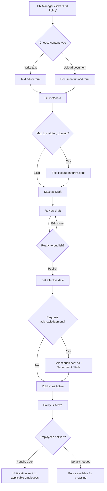
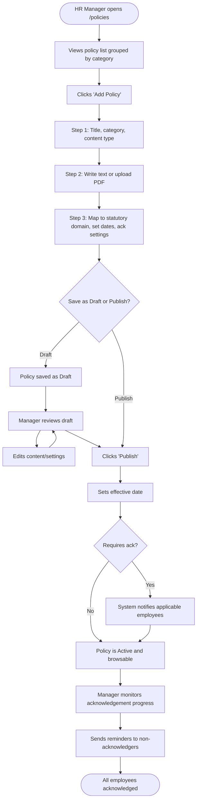
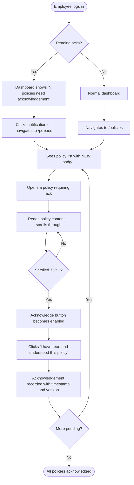
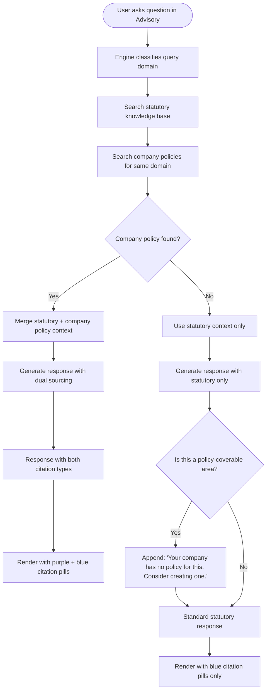

# Company Policy Management -- UX Design Specification

**Date**: 2026-03-31
**Status**: Design proposal
**Scope**: Web application (`apps/web`). Mobile (Flutter) deferred.

---

## Executive Summary

The current `/policies` page is a read-only accordion of four hardcoded statutory summaries. It serves as a placeholder, not a management tool. This design transforms it into a full policy lifecycle system: upload, version, map to statutory domains, distribute to employees, and integrate with the advisory engine.

**Top 5 design decisions:**

1. Replace the flat accordion with a two-panel layout: categorized policy list (left) and policy detail/editor (right)
2. Add a fourth `AuthorityLevel` -- `"company-policy"` -- to the existing citation system, visually distinct from statutory/guideline/best-practice
3. Build the compliance dashboard integration as an overlay on the existing `/compliance/[category]` pages, not a separate section
4. Use the existing tab pattern (from employee detail) for policy detail views: Overview, Content, History, Acknowledgements
5. Employee policy browsing uses the same page with role-gated controls (no separate employee policies page)

---

## 1. Information Architecture

### 1.1 Policy Taxonomy

Policies are organized by **category**, with each category mapping to zero or more **statutory domains**. This is the critical bridge between company policies and the advisory engine.

```
Category (UI grouping)          Statutory Domain Mapping
-------------------------------  ----------------------------------
Employment Terms                 employment_act
Leave & Absence                  employment_act (Part X)
Compensation & Benefits          employment_act, cpf
Workplace Safety                 wsh
Fair Employment                  fair_employment
Foreign Worker                   foreign_manpower
Tax & Filing                     tax
General / HR                     (none -- company-only)
Code of Conduct                  (none -- company-only)
```

**Design rationale**: Categories are human-facing labels that HR managers understand. Statutory domain mappings are system-facing links that the advisory engine uses. An HR manager should never need to know what `employment_act` means internally -- they select "This policy relates to: Leave entitlements" from a dropdown.

### 1.2 Policy Data Model (UI-facing)

```typescript
interface Policy {
  id: number;
  title: string;
  category: PolicyCategory;
  status: "draft" | "active" | "archived";
  version: string;               // e.g., "2.1"
  effective_date: string;         // ISO date
  expiry_date?: string;           // ISO date, optional
  summary: string;                // 1-2 sentence description
  content_type: "text" | "document";
  content_text?: string;          // Markdown for text-entered policies
  document_url?: string;          // URL for uploaded PDF/Word
  document_name?: string;         // Original filename
  statutory_domains: string[];    // e.g., ["employment_act", "cpf"]
  requires_acknowledgement: boolean;
  applicable_to: "all" | "department" | "role";
  applicable_filter?: string[];   // Department names or role names
  created_by: string;
  created_at: string;
  updated_at: string;
}

interface PolicyAcknowledgement {
  id: number;
  policy_id: number;
  employee_id: number;
  employee_name: string;
  acknowledged_at: string;
  version_acknowledged: string;
}

type PolicyCategory =
  | "employment_terms"
  | "leave_absence"
  | "compensation_benefits"
  | "workplace_safety"
  | "fair_employment"
  | "foreign_worker"
  | "tax_filing"
  | "general_hr"
  | "code_of_conduct";
```

### 1.3 Navigation Placement

In the admin sidebar, the Policies page moves from the "Tools" group to the "Core" group, positioned between Compliance and Calculators:

```
CORE
  Dashboard
  Advisory
  Compliance
  Policies        <-- promoted from standalone to core nav
TOOLS
  Calculators
  Documents
```

For employees, "Policies" appears in the employee nav between "My Attendance" and "Advisory":

```
EMPLOYEE
  My Dashboard
  My Profile
  My Leave
  My Claims
  My Payslips
  My Attendance
  Policies          <-- new entry
  Advisory
```

**Rationale**: Policies are referenced daily by HR managers (when answering employee questions) and periodically by employees (onboarding, annual reviews). This frequency justifies core nav placement for admin. For employees, placing it near Advisory creates a natural flow: "read the policy, then ask the AI if you have questions."

---

## 2. Page Layouts

### 2.1 Policy List Page (`/policies`) -- Admin View

```
+------------------------------------------------------------------+
| [FileText icon] Company Policies                                  |
| Manage, version, and distribute company policies.                |
|                                                                  |
| [+ Add Policy]                              [Search...] [Filter] |
+------------------------------------------------------------------+
|                                                                  |
| TABS: All (12) | Active (8) | Draft (3) | Archived (1)          |
|                                                                  |
| +--------------------------------------------------------------+ |
| | CATEGORY: Employment Terms                              [2]  | |
| | +----------------------------------------------------------+ | |
| | | [doc] Employment Contract Template        v2.0  Active   | | |
| | |       Effective: 1 Jan 2026 | Employment Act             | | |
| | +----------------------------------------------------------+ | |
| | | [doc] Probation & Confirmation Policy     v1.1  Active   | | |
| | |       Effective: 15 Mar 2026 | Employment Act            | | |
| | +----------------------------------------------------------+ | |
| +--------------------------------------------------------------+ |
|                                                                  |
| +--------------------------------------------------------------+ |
| | CATEGORY: Leave & Absence                               [3]  | |
| | +----------------------------------------------------------+ | |
| | | [doc] Annual & Sick Leave Policy          v3.0  Active   | | |
| | |       Effective: 1 Jan 2026 | Employment Act             | | |
| | |       [!] 4 employees pending acknowledgement            | | |
| | +----------------------------------------------------------+ | |
| | | [doc] Parental Leave Policy               v1.0  Draft    | | |
| | |       No effective date set                              | | |
| | +----------------------------------------------------------+ | |
| | | [doc] Compassionate Leave Policy          v2.0  Active   | | |
| | |       Effective: 1 Jan 2026 | Employment Act             | | |
| | +----------------------------------------------------------+ | |
| +--------------------------------------------------------------+ |
|                                                                  |
| +--------------------------------------------------------------+ |
| | CATEGORY: Workplace Safety                              [1]  | |
| | +----------------------------------------------------------+ | |
| | | [doc] WSH Policy & Emergency Procedures   v1.2  Active   | | |
| | |       Effective: 1 Jun 2025 | WSH                        | | |
| | +----------------------------------------------------------+ | |
| +--------------------------------------------------------------+ |
|                                                                  |
+------------------------------------------------------------------+
```

**Component specifications:**

- **Page header**: Uses the existing pattern (`h1` + subtitle + icon), matching `/compliance`, `/employees`, `/leave`.
- **Primary CTA**: "Add Policy" button, top-right, `AppButton variant="primary"`. Always visible without scrolling.
- **Search**: `AppInput` with Search icon, filters by title and content. Debounced 300ms.
- **Filter dropdown**: Category filter (multi-select) and status filter (single-select).
- **Status tabs**: Horizontal pill tabs matching the pattern used in leave applications (All/Pending/Approved/Rejected). Counts shown in parentheses.
- **Category groups**: Collapsible sections. Each shows category name and policy count. Default: all expanded.
- **Policy row**: `AppCard variant="flat"` per policy. Shows title, version badge, status badge, effective date, mapped statutory domain(s) as `SourceCitation` pills with `authority="company-policy"` (new level), and a pending-acknowledgement warning when applicable.
- **Empty state**: Uses `EmptyState` component. "No company policies yet. Add your first policy to get started."

### 2.2 Policy List Page (`/policies`) -- Employee View

The same route, but role-gated to hide admin controls:

```
+------------------------------------------------------------------+
| [FileText icon] Company Policies                                  |
| Review company policies and guidelines.                          |
|                                                                  |
|                                                      [Search...] |
+------------------------------------------------------------------+
|                                                                  |
| [!] 2 policies require your acknowledgement           [View ->] |
|                                                                  |
| CATEGORY: Employment Terms                                       |
| +--------------------------------------------------------------+ |
| | [doc] Employment Contract Template            v2.0           | |
| |       Last updated: 1 Jan 2026                               | |
| +--------------------------------------------------------------+ |
| | [doc] Probation & Confirmation Policy         v1.1           | |
| |       Last updated: 15 Mar 2026                              | |
| +--------------------------------------------------------------+ |
|                                                                  |
| CATEGORY: Leave & Absence                                        |
| +--------------------------------------------------------------+ |
| | [doc] Annual & Sick Leave Policy              v3.0  [NEW]    | |
| |       Last updated: 1 Jan 2026                               | |
| |       [!] Acknowledgement required                           | |
| +--------------------------------------------------------------+ |
|                                                                  |
+------------------------------------------------------------------+
```

**Key differences from admin view:**

- No "Add Policy" button
- No Draft/Archived tabs (employees only see Active policies)
- No status badges (all shown policies are active)
- "[NEW]" badge on policies updated since the employee's last acknowledgement
- Acknowledgement banner at the top when any policies need signing
- No filter by status (only search and category filter)

### 2.3 Policy Detail Page (`/policies/[id]`) -- Admin View

Uses the existing tab pattern from `/employees/[id]`:

```
+------------------------------------------------------------------+
| <- Back to Policies                                              |
|                                                                  |
| [FileText] Annual & Sick Leave Policy                            |
| Leave & Absence | v3.0 | Active                                 |
|                                                                  |
| [Edit]  [Archive]  [Distribute]                                  |
+------------------------------------------------------------------+
|                                                                  |
| TABS: Overview | Content | Versions | Acknowledgements          |
|                                                                  |
+------------------------------------------------------------------+
```

**Tab: Overview**

```
+------------------------------------------------------------------+
|  +---------------------------+  +------------------------------+ |
|  | Policy Details            |  | Statutory Mapping            | |
|  | Category: Leave & Absence |  | [EA] Employment Act, Part X  | |
|  | Status:   Active          |  | [EA] Employment Act, Sec 88A | |
|  | Version:  3.0             |  |                              | |
|  | Effective: 1 Jan 2026     |  | Coverage: Exceeds statutory  | |
|  | Expiry:   None            |  | minimum (14 days AL vs 7    | |
|  | Applies to: All employees |  | required)                   | |
|  +---------------------------+  +------------------------------+ |
|                                                                  |
|  +-----------------------------------------------------------+  |
|  | Summary                                                    |  |
|  | This policy outlines the company's leave entitlements      |  |
|  | including annual leave, sick leave, and hospitalisation    |  |
|  | leave. It exceeds the Employment Act minimum entitlements. |  |
|  +-----------------------------------------------------------+  |
|                                                                  |
|  +-----------------------------------------------------------+  |
|  | Acknowledgement Status                                     |  |
|  | [============================------] 28 / 32 employees     |  |
|  | 4 employees have not yet acknowledged this version.        |  |
|  | [Send Reminder]                                            |  |
|  +-----------------------------------------------------------+  |
+------------------------------------------------------------------+
```

**Tab: Content**

For text-based policies: rendered Markdown with an "Edit" button that switches to a Markdown editor.

For document-based policies: embedded PDF viewer (if PDF) or download link (if Word), with a "Replace Document" upload button.

```
+------------------------------------------------------------------+
|  [Edit Content]                                                  |
|                                                                  |
|  ## 1. Annual Leave                                              |
|                                                                  |
|  All confirmed employees are entitled to the following annual    |
|  leave based on their length of service:                         |
|                                                                  |
|  | Years of Service | Entitlement |                              |
|  |-----------------|-------------|                              |
|  | 1st year        | 14 days     |                              |
|  | 2nd year        | 14 days     |                              |
|  | 3rd year        | 15 days     |                              |
|  | 4th year        | 16 days     |                              |
|  | 5+ years        | 18 days     |                              |
|                                                                  |
|  ## 2. Sick Leave                                                |
|  ...                                                             |
+------------------------------------------------------------------+
```

**Tab: Versions**

```
+------------------------------------------------------------------+
|  +-----------------------------------------------------------+  |
|  | v3.0 | 1 Jan 2026 | Current                               |  |
|  | Updated leave entitlements to exceed EA minimums.          |  |
|  | Changed by: Sarah Lim                                     |  |
|  +-----------------------------------------------------------+  |
|  | v2.0 | 1 Jul 2025 | Superseded                            |  |
|  | Added hospitalisation leave section.                      |  |
|  | Changed by: Sarah Lim                                     |  |
|  +-----------------------------------------------------------+  |
|  | v1.0 | 1 Jan 2025 | Superseded                            |  |
|  | Initial policy creation.                                  |  |
|  | Changed by: Admin                                         |  |
|  +-----------------------------------------------------------+  |
+------------------------------------------------------------------+
```

**Tab: Acknowledgements**

```
+------------------------------------------------------------------+
|  Acknowledged (28)                    Pending (4)                |
|                                                                  |
|  [Send Reminder to All Pending]                                  |
|                                                                  |
|  +-----------------------------------------------------------+  |
|  | [avatar] John Tan                                         |  |
|  | Acknowledged v3.0 on 5 Jan 2026                           |  |
|  +-----------------------------------------------------------+  |
|  | [avatar] Mary Chua                                        |  |
|  | Acknowledged v3.0 on 3 Jan 2026                           |  |
|  +-----------------------------------------------------------+  |
|  ...                                                             |
|                                                                  |
|  PENDING:                                                        |
|  +-----------------------------------------------------------+  |
|  | [avatar] Ahmad Ibrahim                                    |  |
|  | Last reminded: 15 Jan 2026              [Send Reminder]   |  |
|  +-----------------------------------------------------------+  |
|  | [avatar] Li Wei                                           |  |
|  | Last reminded: 15 Jan 2026              [Send Reminder]   |  |
|  +-----------------------------------------------------------+  |
+------------------------------------------------------------------+
```

### 2.4 Policy Detail Page (`/policies/[id]`) -- Employee View

Simplified: no Edit/Archive/Distribute buttons. No Versions tab. No Acknowledgements tab listing other employees.

```
+------------------------------------------------------------------+
| <- Back to Policies                                              |
|                                                                  |
| [FileText] Annual & Sick Leave Policy                            |
| Leave & Absence | v3.0 | Updated 1 Jan 2026                    |
+------------------------------------------------------------------+
|                                                                  |
| [!] This policy requires your acknowledgement.                   |
|                                                                  |
| ## 1. Annual Leave                                               |
| ...policy content rendered as Markdown or embedded PDF...        |
|                                                                  |
+------------------------------------------------------------------+
| I have read and understood this policy.                          |
|                                                                  |
| [Acknowledge Policy]                                             |
+------------------------------------------------------------------+
```

The acknowledgement section is a sticky footer that remains visible as the employee scrolls through the policy content. The button is disabled until the employee has scrolled to at least 75% of the content (a simple scroll-depth check, not a timer -- we want genuine reading, not forced waiting).

---

## 3. Add/Edit Policy Flow

### 3.1 User Flow Diagram



### 3.2 Add Policy Modal (Step 1: Basics)

Uses a slide-over drawer (right side, 640px width) matching the pattern used in employee invite and leave application forms. The drawer has three steps with a `StepIndicator` at the top.

```
+-------------------------------------------+
| X  Add New Policy                    1/3  |
|    [===-----] Basics                      |
+-------------------------------------------+
|                                           |
| Title *                                   |
| [____________________________________]    |
|                                           |
| Category *                                |
| [v Employment Terms                  ]    |
|                                           |
| Content Type *                            |
| ( ) Write policy text                     |
| ( ) Upload document (PDF, Word)           |
|                                           |
| Summary                                   |
| [____________________________________]    |
| [____________________________________]    |
|                                           |
+-------------------------------------------+
| [Cancel]                        [Next ->] |
+-------------------------------------------+
```

### 3.3 Add Policy Drawer (Step 2: Content)

**If "Write policy text" was selected:**

```
+-------------------------------------------+
| X  Add New Policy                    2/3  |
|    [=========-] Content                   |
+-------------------------------------------+
|                                           |
| Policy Content *                          |
| Supports Markdown formatting              |
|                                           |
| +---------------------------------------+ |
| | **B** *I* ~S~ [link] [list] [table]   | |
| |---------------------------------------| |
| | ## 1. Purpose                         | |
| |                                       | |
| | This policy outlines...               | |
| |                                       | |
| |                                       | |
| |                                       | |
| +---------------------------------------+ |
|                                           |
| [Preview]                                 |
|                                           |
+-------------------------------------------+
| [<- Back]                       [Next ->] |
+-------------------------------------------+
```

**If "Upload document" was selected:**

```
+-------------------------------------------+
| X  Add New Policy                    2/3  |
|    [=========-] Content                   |
+-------------------------------------------+
|                                           |
| Upload Policy Document                    |
|                                           |
| +---------------------------------------+ |
| |                                       | |
| |    [Upload icon]                      | |
| |                                       | |
| |    Drop a file here or click to       | |
| |    browse. PDF or Word, max 10MB.     | |
| |                                       | |
| +---------------------------------------+ |
|                                           |
| OR                                        |
|                                           |
| Paste a link to an existing document:     |
| [____________________________________]    |
|                                           |
+-------------------------------------------+
| [<- Back]                       [Next ->] |
+-------------------------------------------+
```

### 3.4 Add Policy Drawer (Step 3: Settings)

```
+-------------------------------------------+
| X  Add New Policy                    3/3  |
|    [=============] Settings               |
+-------------------------------------------+
|                                           |
| Statutory Domain Mapping (optional)       |
| Link this policy to legal requirements    |
| so the advisory AI can reference it.      |
|                                           |
| [x] Employment Act                       |
| [ ] CPF                                  |
| [ ] Foreign Manpower (EFMA)              |
| [ ] Workplace Safety (WSH)               |
| [ ] Fair Employment (TAFEP)              |
| [ ] Tax / IRAS                           |
|                                           |
| Effective Date                            |
| [____/__/____]  Leave blank to save as    |
|                 draft                     |
|                                           |
| Requires Acknowledgement                  |
| [toggle: ON]                              |
|                                           |
| Applicable To                             |
| (x) All employees                         |
| ( ) Specific departments                  |
| ( ) Specific roles                        |
|                                           |
+-------------------------------------------+
| [<- Back]  [Save as Draft] [Save & Publish]|
+-------------------------------------------+
```

**Interaction notes:**

- "Save as Draft" saves with `status: "draft"` regardless of effective date.
- "Save & Publish" validates that an effective date is set, then saves with `status: "active"`.
- If `requires_acknowledgement` is ON and status is Active, a confirmation dialog appears: "This will notify [N] employees to acknowledge this policy. Continue?"

---

## 4. Advisory Integration UX

This is the highest-impact design decision. When the advisory engine answers a question using company policy alongside statutory law, users must clearly understand which source is which.

### 4.1 New Authority Level: `company-policy`

Extend the existing `AuthorityLevel` type:

```typescript
// Current
export type AuthorityLevel = "statutory" | "guideline" | "best-practice";

// Proposed
export type AuthorityLevel =
  | "statutory"
  | "guideline"
  | "best-practice"
  | "company-policy";    // NEW
```

**New design tokens** (added to `globals.css`):

```css
--color-authority-company: #7C3AED;         /* Purple-600 */
--color-authority-company-bg: #F5F3FF;      /* Purple-50 */
```

**Visual treatment:**

| Authority Level | Color | Label | Use Case |
|----------------|-------|-------|----------|
| Statutory | Blue (#2563EB) | "Statutory" | Acts of Parliament (EA, CPFA, EFMA, WSHA) |
| Guideline | Amber (#D97706) | "Guideline" | Tripartite guidelines (TGFEP, TAFEP) |
| Best Practice | Green (#16A34A) | "Best Practice" | MOM advisories, industry standards |
| Company Policy | Purple (#7C3AED) | "Company Policy" | Uploaded company policies |

**Rationale for purple**: It must be visually distinct from statutory (blue), guideline (amber), and best-practice (green). Purple sits outside the existing color associations (blue = law, amber = caution, green = good) and communicates "internal/organizational" rather than "external/regulatory." It avoids the "AI Slop" purple-gradient trap because it is used sparingly as a badge accent, not a background gradient.

### 4.2 Advisory Response with Mixed Sources

When the advisory engine cites both statutory law and company policy, the response renders as:

```
+------------------------------------------------------------------+
| [AI]                                                              |
|                                                                  |
| [Green] Low Risk                                                 |
|                                                                  |
| Your company's leave policy **exceeds** the statutory minimum.   |
|                                                                  |
| Under the Employment Act, employees with 1 year of service are   |
| entitled to a minimum of 7 days annual leave. However, your      |
| company policy provides 14 days from the first year, which is    |
| more generous than the legal requirement.                        |
|                                                                  |
| **Statutory minimum**: 7 days (Employment Act, Part X)           |
| **Your company policy**: 14 days (Annual & Sick Leave Policy)    |
|                                                                  |
| Sources:                                                         |
| [Statutory: Employment Act, Part X]                              |
| [Company Policy: Annual & Sick Leave Policy v3.0]                |
|                                                                  |
| Was this helpful?  [thumbs up] [thumbs down]                     |
+------------------------------------------------------------------+
```

**Key design decisions:**

1. **Sources section is always at the bottom** (matching current pattern). Company policy citations use the purple `SourceCitation` pill.
2. **Inline distinction**: When the response text contrasts statutory vs company, it uses bold labels ("Statutory minimum" vs "Your company policy") rather than inline badges, to keep the prose readable.
3. **Clicking a company policy citation** opens a slide-over with the policy content (same as clicking a statutory citation opens the `ProvisionViewer`). The slide-over shows the policy title, version, effective date, and the specific section referenced.
4. **When no company policy exists**: The advisory engine mentions this as an actionable gap: "Your company does not have a documented leave policy. We recommend creating one. [Create Leave Policy ->]" with a deep link to `/policies?action=add&category=leave_absence`.

### 4.3 Extended ProvisionCited Type

```typescript
// Current
export interface ProvisionCited {
  provision_id: string;
  title: string;
  relevance: number;
  authority_level?: string;
}

// Proposed
export interface ProvisionCited {
  provision_id: string;
  title: string;
  relevance: number;
  authority_level?: string;
  // New fields for company policy sources
  source_type?: "statutory" | "company_policy";
  policy_id?: number;         // Links to CompanyPolicy.id
  policy_version?: string;    // e.g., "3.0"
}
```

The `source_type` field disambiguates: if `"company_policy"`, then `authority_level` is always `"company-policy"`, and `policy_id` links to the full policy detail. If `"statutory"` or absent, behavior is unchanged.

---

## 5. Compliance Dashboard Integration

### 5.1 Design Approach

Instead of building a new "Policy Compliance" dashboard, augment the existing `/compliance/[category]` pages with a "Company Policies" section. This avoids creating a parallel navigation structure and reinforces the connection: "this statutory domain has these company policies covering it."

### 5.2 Updated Compliance Category Page

Add a new section between the "Status overview" card and the "Findings" section:

```
+------------------------------------------------------------------+
| <- Back to Compliance Check                                      |
| [Shield] Employment Act                                          |
|                                                                  |
| [Status overview card -- existing, unchanged]                    |
|                                                                  |
+------------------------------------------------------------------+
| COMPANY POLICY COVERAGE                                    [NEW] |
|                                                                  |
| +--------------------------------------------------------------+ |
| | Policies mapped to this domain: 3                            | |
| |                                                              | |
| | [green dot] Employment Contract Template    v2.0  Active     | |
| |             Covers: KET requirements, notice periods         | |
| |             100% acknowledged                                | |
| |                                                              | |
| | [green dot] Annual & Sick Leave Policy      v3.0  Active     | |
| |             Covers: AL, SL, hospitalisation leave            | |
| |             87% acknowledged (4 pending)                     | |
| |                                                              | |
| | [green dot] Overtime Policy                 v1.0  Active     | |
| |             Covers: OT calculation, Part IV compliance       | |
| |             100% acknowledged                                | |
| +--------------------------------------------------------------+ |
|                                                                  |
| [!] Statutory areas without company policy:                      |
| +--------------------------------------------------------------+ |
| | [amber dot] Payslip requirements (EA s88A)                   | |
| |             No company policy covers itemised payslip rules. | |
| |             [Create Policy ->]                                | |
| |                                                              | |
| | [amber dot] Retirement & re-employment (EA Part IX)          | |
| |             No company policy covers re-employment terms.    | |
| |             [Create Policy ->]                                | |
| +--------------------------------------------------------------+ |
+------------------------------------------------------------------+
| Findings (existing section -- unchanged)                         |
+------------------------------------------------------------------+
```

### 5.3 Compliance Overview Page (`/compliance`)

On the main compliance overview (the grid of domain cards), add a small "policy coverage" indicator to each domain card:

```
+-------------------------------+
| [Shield] Employment Act       |
| Status: Covered               |
| 42 provisions in KB           |
|                               |
| Company policies: 3 mapped    |  <-- NEW line
| Coverage gaps: 2              |  <-- NEW line
+-------------------------------+
```

### 5.4 Coverage Gap Detection Logic

A "coverage gap" is identified when:

1. A statutory domain has a known sub-category (e.g., Employment Act has: KET, payslips, leave, overtime, notice period, retrenchment, retirement)
2. No company policy is mapped to that sub-category
3. The compliance gap analysis (existing backend) flags it as a finding

This means the gap detection is driven by the existing compliance engine, not by a separate policy-checking system. The policy coverage section simply surfaces: "You have findings in this area, and no company policy addresses it."

---

## 6. User Flow Diagrams

### 6.1 HR Manager: End-to-End Policy Creation



### 6.2 Employee: Policy Acknowledgement Flow



### 6.3 Advisory Engine: Policy-Aware Response Flow



---

## 7. Component Specifications

### 7.1 PolicyCard (List Item)

```
Component: PolicyCard
Location: src/components/policies/PolicyCard.tsx
Base: AppCard variant="flat"

Props:
  policy: Policy
  onClick: () => void
  showAdminControls: boolean   // false for employee view

States:
  - Default: white background, gray-200 border
  - Hover: gray-50 background, slight border color change
  - Active (current policy selected): primary-bg background, primary border-left (3px)

Layout:
  [icon 36x36] [title + meta]                    [status badge] [chevron]
               [effective date] [statutory pills]

Badge variants:
  - Status: "Active" (emerald), "Draft" (gray), "Archived" (gray muted)
  - NEW badge: primary-bg with primary text, shown for employees on updated policies
  - Pending ack warning: amber text with AlertTriangle icon
```

### 7.2 PolicyCategoryGroup (Collapsible Section)

```
Component: PolicyCategoryGroup
Location: src/components/policies/PolicyCategoryGroup.tsx

Props:
  category: PolicyCategory
  categoryLabel: string
  policies: Policy[]
  defaultExpanded: boolean
  onPolicyClick: (id: number) => void
  showAdminControls: boolean

Layout:
  [ChevronDown/Right] [Category label]       [count badge]
  -------------------------------------------------------
  PolicyCard
  PolicyCard
  PolicyCard

Interaction:
  - Click header to collapse/expand
  - Smooth height animation (200ms ease-out)
  - Collapsed: shows only header row
  - Expanded: shows all PolicyCards with 8px gap
```

### 7.3 PolicyDetailDrawer (for mobile/quick view)

```
Component: PolicyDetailDrawer
Location: src/components/policies/PolicyDetailDrawer.tsx

Props:
  policy: Policy
  isOpen: boolean
  onClose: () => void
  mode: "admin" | "employee"

Behavior:
  - Slide-in from right, 640px width on desktop, full-width on mobile
  - Contains tab interface: Overview | Content | Versions | Acknowledgements
  - Admin mode: shows all tabs and edit controls
  - Employee mode: shows Content only with acknowledgement footer
  - Esc key closes
  - Click outside closes (with backdrop)

Animation:
  - Enter: slide from right, 200ms ease-out, backdrop fade 150ms
  - Exit: slide to right, 150ms ease-in, backdrop fade 100ms
```

### 7.4 PolicyAcknowledgementFooter

```
Component: PolicyAcknowledgementFooter
Location: src/components/policies/PolicyAcknowledgementFooter.tsx

Props:
  policy: Policy
  hasAcknowledged: boolean
  acknowledgedVersion?: string
  scrollProgress: number        // 0 to 1
  onAcknowledge: () => void
  isSubmitting: boolean

Layout:
  Sticky bottom bar (64px height), white background, top border.

States:
  - Not yet scrolled enough: Button disabled, text "Read to the end to acknowledge"
  - Scrolled 75%+: Button enabled, text "I have read and understood this policy"
  - Submitting: Button shows spinner
  - Already acknowledged: Green check + "Acknowledged on [date] (v[version])"
  - Needs re-acknowledgement: "Updated since your last acknowledgement. Please re-read and acknowledge."
```

### 7.5 CompanyPolicyCitation (Advisory Extension)

```
Component: Extended SourceCitation
Location: src/components/design-system/SourceCitation.tsx (modified)

Changes:
  - Add "company-policy" to AuthorityLevel union type
  - Add style: bg purple-50, text purple-600, border purple-600
  - Add label: "Company Policy"

  - When clicked for company-policy type:
    Opens PolicyDetailDrawer instead of ProvisionViewer
    Shows the specific policy content and version cited

New token:
  authorityStyles["company-policy"] =
    "bg-[var(--color-authority-company-bg)] text-[var(--color-authority-company)] border-[var(--color-authority-company)]"
```

### 7.6 PolicyUploadZone

```
Component: PolicyUploadZone
Location: src/components/policies/PolicyUploadZone.tsx

Props:
  onFileSelected: (file: File) => void
  onUrlPasted: (url: string) => void
  acceptedTypes: string[]         // [".pdf", ".doc", ".docx"]
  maxSizeMB: number               // 10
  currentFile?: { name: string; size: number }

Layout:
  Dashed border drop zone (200px height).
  Upload icon centered.
  "Drop a file here or click to browse" text.
  Accepted formats and size limit shown below.

States:
  - Default: gray dashed border, gray text
  - Drag over: primary dashed border, primary-bg background
  - File selected: solid border, file name + size + Remove button
  - Error: red border, error message below
  - Uploading: progress bar inside the zone

Interaction:
  - Click opens native file picker
  - Drag and drop supported
  - Validates file type and size on selection
  - Shows error inline (not toast) for invalid files
```

---

## 8. State Management

### 8.1 API Endpoints (Frontend Expectations)

```
GET    /api/policies                          List all policies for the company
GET    /api/policies/:id                      Get policy detail with content
POST   /api/policies                          Create new policy
PUT    /api/policies/:id                      Update policy
PATCH  /api/policies/:id/status               Change status (publish/archive)
POST   /api/policies/:id/distribute           Send acknowledgement notifications
GET    /api/policies/:id/acknowledgements      List acknowledgements for a policy
POST   /api/policies/:id/acknowledge          Employee acknowledges a policy
GET    /api/policies/pending-acknowledgements  Employee's pending acknowledgements
POST   /api/policies/:id/upload               Upload document attachment
```

### 8.2 React Hooks

```typescript
// Policy list with filtering
function usePolicies(filters?: { status?: string; category?: string }) {
  // Returns { policies, isLoading, error, refetch }
}

// Single policy detail
function usePolicy(id: number) {
  // Returns { policy, isLoading, error, refetch }
}

// Acknowledgement tracking
function usePolicyAcknowledgements(policyId: number) {
  // Returns { acknowledgements, stats: { total, acknowledged, pending }, isLoading }
}

// Employee's pending acknowledgements (for banner)
function usePendingAcknowledgements() {
  // Returns { pendingPolicies, count, isLoading }
}

// Mutations
function useCreatePolicy() { /* Returns { mutate, isLoading } */ }
function useUpdatePolicy() { /* Returns { mutate, isLoading } */ }
function useAcknowledgePolicy() { /* Returns { mutate, isLoading } */ }
function useDistributePolicy() { /* Returns { mutate, isLoading } */ }
```

---

## 9. Prioritized Implementation Roadmap

### Phase 1: Foundation (P0 -- 3-4 days)

| Task | Description | Effort |
|------|-------------|--------|
| 9.1 | Backend: Extend `CompanyPolicy` model with new fields (version, status, statutory_domains, requires_acknowledgement, applicable_to) | 4h |
| 9.2 | Backend: CRUD endpoints for policies | 4h |
| 9.3 | Backend: `PolicyAcknowledgement` model + endpoints | 3h |
| 9.4 | Frontend: Policy list page with category grouping, search, status tabs | 6h |
| 9.5 | Frontend: Add Policy drawer (3-step form) | 5h |
| 9.6 | Frontend: Policy detail page with tabs | 4h |

### Phase 2: Employee Experience (P1 -- 2-3 days)

| Task | Description | Effort |
|------|-------------|--------|
| 9.7 | Frontend: Employee policy view (role-gated) | 3h |
| 9.8 | Frontend: Acknowledgement footer with scroll tracking | 3h |
| 9.9 | Frontend: Pending acknowledgement banner on dashboard | 2h |
| 9.10 | Backend: Notification service for policy distribution | 4h |
| 9.11 | Frontend: Send reminder functionality | 2h |

### Phase 3: Advisory Integration (P1 -- 2-3 days)

| Task | Description | Effort |
|------|-------------|--------|
| 9.12 | Design system: Add `company-policy` authority level + tokens | 1h |
| 9.13 | Backend: Advisory engine searches company policies alongside KB | 6h |
| 9.14 | Frontend: Render company policy citations in advisory responses | 3h |
| 9.15 | Frontend: PolicyDetailDrawer opened from citation click | 2h |
| 9.16 | Frontend: "Create Policy" deep link from advisory gap suggestions | 1h |

### Phase 4: Compliance Integration (P2 -- 1-2 days)

| Task | Description | Effort |
|------|-------------|--------|
| 9.17 | Backend: Policy coverage analysis per statutory domain | 4h |
| 9.18 | Frontend: Company Policy Coverage section on `/compliance/[category]` | 3h |
| 9.19 | Frontend: Coverage gap indicators on `/compliance` overview cards | 2h |

### Phase 5: Polish (P3 -- 1 day)

| Task | Description | Effort |
|------|-------------|--------|
| 9.20 | Document upload with PDF preview | 3h |
| 9.21 | Markdown editor with toolbar for text policies | 2h |
| 9.22 | Version diff view (compare two versions) | 3h |
| 9.23 | Bulk acknowledgement reminders | 1h |

**Total estimated effort**: 10-13 working days for full implementation.

---

## 10. Design System Compliance Audit

### 10.1 Patterns Reused from Existing Codebase

| Pattern | Source | Usage |
|---------|--------|-------|
| Page header with icon + title + subtitle | `/compliance`, `/employees`, `/leave` | Policy list and detail headers |
| Status badges (emerald/amber/gray) | `/employees`, `/leave` | Policy status (Active/Draft/Archived) |
| AppCard variant="flat" for list items | `/policies` (current), `/compliance/[category]` | Policy cards in list |
| AppCard variant="elevated" for summary | `/compliance/[category]` status overview | Policy detail overview card |
| Tab interface with icon + label | `/employees/[id]` (12 tabs) | Policy detail tabs |
| SourceCitation with authority levels | Advisory SystemMessage, ProvisionViewer | Extended with company-policy level |
| StepIndicator for multi-step forms | Existing component in design system | Add Policy drawer |
| EmptyState for zero-data screens | `/employees`, `/leave` | Empty policy list |
| Slide-over drawer pattern | Employee invite, leave application | Add/Edit policy drawer |
| Search + filter bar | `/employees` | Policy search and category filter |
| AlertBanner for notifications | Dashboard, compliance | Pending acknowledgement alerts |
| LoadingState variant="card" | `/compliance/[category]` | Policy list loading skeleton |

### 10.2 New Components Required

| Component | Justification |
|-----------|--------------|
| PolicyCard | Specialized list item with multi-line metadata (version, date, domain, ack status). Cannot be achieved with a generic card alone. |
| PolicyCategoryGroup | Collapsible section grouping. Similar to but distinct from the accordion in current `/policies`. |
| PolicyAcknowledgementFooter | Sticky footer with scroll-depth gating. Unique interaction pattern. |
| PolicyUploadZone | File drag-and-drop with validation. Could become a shared component later. |

### 10.3 AI Slop Check

| Fingerprint | Present? | Notes |
|------------|----------|-------|
| Inter/Roboto default | No | Uses Source Sans 3 (existing design system) |
| Purple-to-blue gradients | No | Purple used only as a badge accent for company-policy authority level |
| Cards-in-cards nesting | No | Flat card layout within collapsible sections |
| Glassmorphism | No | Standard solid surfaces |
| Uniform rounded-2xl | No | Uses existing 12px border radius from AppCard |
| Shadow-lg everywhere | No | Uses design system shadow tokens (--shadow-card, --shadow-raised) |
| Gratuitous gradient text | No | No gradient text anywhere |
| Bounce/elastic animations | No | Standard ease-out transitions |

**Verdict**: PASS (0 fingerprints detected)

---

## 11. Accessibility Considerations

1. **Keyboard navigation**: All policy cards are focusable with Tab. Enter/Space opens the detail view. Esc closes drawers.
2. **Screen reader**: Category groups use `role="region"` with `aria-label`. Expand/collapse state announced via `aria-expanded`. Acknowledgement progress bar uses `role="progressbar"` with `aria-valuenow`.
3. **Color contrast**: All badge text meets WCAG AA (4.5:1 minimum). The new purple (#7C3AED on #F5F3FF) achieves 5.2:1 contrast ratio.
4. **Scroll-depth gating**: The 75% scroll requirement for acknowledgement includes an "I confirm I have read this policy" checkbox as a keyboard-accessible alternative for users who cannot scroll (e.g., screen magnification users).

---

## 12. Open Questions for Product Decision

1. **Policy versioning granularity**: Should editing an active policy automatically create a new version, or should the HR manager explicitly choose "Create New Version" vs "Edit Current Version"? Recommendation: auto-version on publish (any edit to a published policy creates a new version).

2. **Acknowledgement re-trigger**: When a policy is updated to a new version, should all employees need to re-acknowledge? Recommendation: configurable per policy -- some policies (e.g., safety) should require re-acknowledgement on every update, while others (e.g., handbook typo fix) should not.

3. **Policy search in advisory**: Should the advisory engine search company policies by default, or only when the user explicitly asks about company policy? Recommendation: always search both, because the value proposition is "your company policy says X, and the law says Y" -- users should not need to know to ask.

4. **Document-based policies and advisory**: If a policy is uploaded as a PDF (not entered as text), can the advisory engine still reference it? This requires PDF text extraction on upload. Recommendation: extract text on upload, store alongside the document URL, use the extracted text for advisory search.
