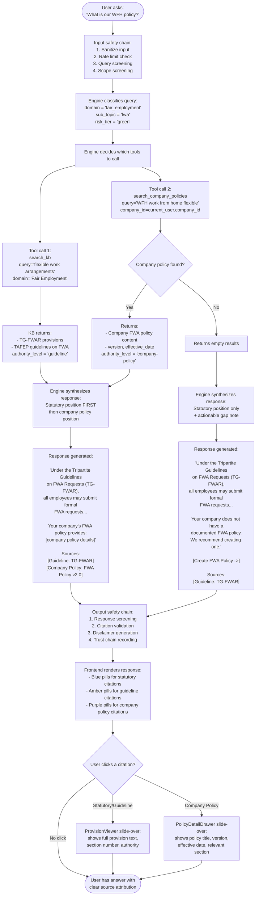
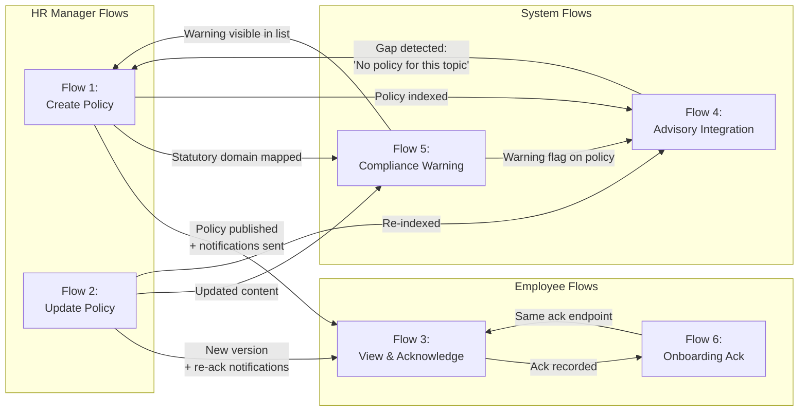

```mermaid
flowchart TD
    START([HR Manager clicks 'Add Policy']) --> DRAWER[Drawer opens: Step 1 - Basics]

    DRAWER --> TITLE[Enter policy title]
    TITLE --> CATEGORY{Select category}
    CATEGORY -->|Predefined| PRED[Choose from 9 categories:\n- Employment Terms\n- Leave & Absence\n- Compensation & Benefits\n- Workplace Safety\n- Fair Employment\n- Foreign Worker\n- Tax & Filing\n- General / HR\n- Code of Conduct]
    CATEGORY -->|Custom| CUSTOM[Enter custom category name]

    PRED --> CONTENT_TYPE{Choose content type}
    CUSTOM --> CONTENT_TYPE

    CONTENT_TYPE -->|Write text| TEXT_STEP[Enter summary text]
    CONTENT_TYPE -->|Upload document| UPLOAD_STEP[Enter summary text]

    TEXT_STEP --> NEXT1[Click Next -> Step 2]
    UPLOAD_STEP --> NEXT1

    NEXT1 --> STEP2{Content type?}
    STEP2 -->|Text| EDITOR[Markdown editor\nWrite or paste policy text]
    STEP2 -->|Document| UPLOAD_ZONE[Drag-drop or browse\nPDF/DOCX, max 10 MB]

    EDITOR --> PREVIEW_OPT[Optional: Click Preview\nto see rendered Markdown]
    PREVIEW_OPT --> NEXT2[Click Next -> Step 3]

    UPLOAD_ZONE --> EXTRACT[System extracts text\nfrom uploaded file]
    EXTRACT --> REVIEW_EXTRACT[Admin reviews extracted text\nConfirms it looks correct]
    REVIEW_EXTRACT --> NEXT2

    NEXT2 --> STEP3[Step 3 - Settings]
    STEP3 --> STATUTORY_MAP{Map to statutory domain?\nOptional}

    STATUTORY_MAP -->|Yes| SELECT_DOMAINS[Select domains:\n- Employment Act\n- CPF\n- Foreign Manpower\n- Workplace Safety\n- Fair Employment\n- Tax / IRAS]
    STATUTORY_MAP -->|Skip| SET_DATE

    SELECT_DOMAINS --> COMPLIANCE_CHECK[System runs statutory floor check\nagainst mapped domains]
    COMPLIANCE_CHECK --> FLOOR_RESULT{Below statutory minimum?}
    FLOOR_RESULT -->|Yes| WARNING[Warning banner shown:\n'This policy may fall below\nstatutory minimums. See details.'\nHR manager can proceed or edit]
    FLOOR_RESULT -->|No| SET_DATE

    WARNING --> PROCEED{HR Manager decision}
    PROCEED -->|Edit| NEXT1
    PROCEED -->|Proceed anyway| SET_DATE

    SET_DATE --> EFFECTIVE[Set effective date\nLeave blank for draft]
    EFFECTIVE --> ACK_TOGGLE[Toggle: Requires acknowledgment?\nDefault: ON]
    ACK_TOGGLE --> AUDIENCE{Select audience}
    AUDIENCE -->|All employees| ALL[applicable_to = 'all']
    AUDIENCE -->|Specific departments| DEPT[Select department names]
    AUDIENCE -->|Specific roles| ROLES[Select role names]

    ALL --> SAVE_CHOICE
    DEPT --> SAVE_CHOICE
    ROLES --> SAVE_CHOICE

    SAVE_CHOICE{Save action}
    SAVE_CHOICE -->|Save as Draft| DRAFT[Policy saved with\nstatus = 'draft']
    SAVE_CHOICE -->|Save & Publish| VALIDATE_DATE{Effective date set?}

    VALIDATE_DATE -->|No| DATE_ERROR[Error: 'Set an effective date\nto publish']
    VALIDATE_DATE -->|Yes| CONFIRM_DIALOG{Requires ack + Active?}

    DATE_ERROR --> SET_DATE

    CONFIRM_DIALOG -->|Yes, ack required| NOTIFY_CONFIRM[Dialog: 'This will notify N\nemployees to acknowledge\nthis policy. Continue?']
    CONFIRM_DIALOG -->|No ack| PUBLISH

    NOTIFY_CONFIRM -->|Confirm| PUBLISH
    NOTIFY_CONFIRM -->|Cancel| SAVE_CHOICE

    PUBLISH[Policy saved with\nstatus = 'active'\nversion = '1.0']
    PUBLISH --> NOTIFY{Acknowledgment required?}
    NOTIFY -->|Yes| SEND_NOTIFICATIONS[Notifications sent to\napplicable employees]
    NOTIFY -->|No| AVAILABLE

    SEND_NOTIFICATIONS --> INDEX_ADVISORY[Advisory engine indexes\nnew company policy]
    AVAILABLE[Policy browsable\non /policies] --> INDEX_ADVISORY
    INDEX_ADVISORY --> END([Policy is live.\nEmployees notified.\nAdvisory engine can find it.])

    DRAFT --> END_DRAFT([Policy saved as draft.\nNot visible to employees.\nNot indexed by advisory.])
```

```mermaid
flowchart TD
    START([New employee completes\naccount setup and\nreaches onboarding checklist]) --> CHECKLIST["Onboarding Checklist:\n\n[check] Create account\n[check] Complete profile\n[check] Review employment terms\n[ ] Review company policies (3)\n[ ] Acknowledge code of conduct\n[ ] Setup complete"]

    CHECKLIST --> CLICK_POLICIES[Employee clicks\n'Review Company Policies']

    CLICK_POLICIES --> POLICY_LIST["Policy acknowledgment view:\n\n'Please review and acknowledge\nthe following company policies.'\n\nProgress: 0 / 3 acknowledged\n[==========----------]"]

    POLICY_LIST --> SHOW_POLICIES["Required policies listed:\n\n[ ] Leave & Absence Policy\n    v3.0 | Effective 1 Jan 2026\n\n[ ] Employee Handbook\n    v2.0 | Effective 1 Jan 2026\n\n[ ] Workplace Safety Policy\n    v1.2 | Effective 1 Jun 2025"]

    SHOW_POLICIES --> SELECT_FIRST[Employee clicks first policy]

    SELECT_FIRST --> READ[Policy content displayed\nwith sticky acknowledgment footer]

    READ --> SCROLL[Employee scrolls\nthrough content]
    SCROLL --> THRESHOLD{Scrolled >= 75%?}

    THRESHOLD -->|No| SCROLL
    THRESHOLD -->|Yes| ENABLE_BTN[Acknowledge button enabled]

    ENABLE_BTN --> ACK_CLICK[Employee clicks\n'I have read and understood\nthis policy']

    ACK_CLICK --> RECORD[Acknowledgment recorded:\n- employee_id\n- policy_id\n- version\n- timestamp\n- ip_address\n- context = 'onboarding']

    RECORD --> UPDATE_PROGRESS["Progress updated:\n1 / 3 acknowledged\n[=============-------]\n\n[check] Leave & Absence Policy\n[ ] Employee Handbook\n[ ] Workplace Safety Policy"]

    UPDATE_PROGRESS --> MORE{More policies\nto acknowledge?}

    MORE -->|Yes| SELECT_NEXT[Employee clicks\nnext policy]
    SELECT_NEXT --> READ

    MORE -->|No, all done| STEP_COMPLETE["Onboarding step marked complete:\n\n[check] Review company policies (3/3)\n\nAll policies acknowledged.\n'Thank you for reviewing\nour company policies.'"]

    STEP_COMPLETE --> NEXT_STEP{More onboarding steps?}

    NEXT_STEP -->|Yes| CONTINUE[Continue to next\nonboarding step]
    NEXT_STEP -->|No| ONBOARDING_DONE([Onboarding complete.\nAll policies acknowledged.\nEmployee fully onboarded.])
```

# Company Policy Upload -- User Flows

**Date**: 2026-03-31
**Status**: Phase 01 deliverable (pre-implementation)
**Depends on**: `01-analysis/01-research/21-company-policy-requirements.md` (requirements), `23-company-policy-ux-design.md` (UX spec), `briefs/02-company-policy-decisions.md` (stakeholder decisions)

---

## Stakeholder Decisions (Reference)

1. **Statutory floor**: Warn, not block, when company policy is below statutory minimums
2. **Employee acknowledgment**: Required -- integrate into onboarding
3. **Advisory integration**: Searchable by advisory engine from day 1
4. **File upload**: PDF/DOCX + manual text entry in v1
5. **Version history**: From the start
6. **Categories**: 9 predefined + custom categories

---

## Flow 1: HR Manager -- Create New Policy

### Trigger

HR manager clicks "Add Policy" on `/policies`.

### Preconditions

- User is authenticated with role `owner` or `hr_manager`
- Company profile exists (company_id is set)
- User has navigated to `/policies` (admin view)

### Happy Path



### System State Changes

| Event | State Change |
|-------|-------------|
| Drawer opens | Frontend: drawer component mounts, step = 1 |
| File uploaded | Backend: file stored in S3/local uploads, text extraction queued |
| Text extracted | Backend: extracted text stored in `CompanyPolicy.content` |
| Save as Draft | DB: `CompanyPolicy` record created with `is_active = False`, `status = 'draft'` |
| Save & Publish | DB: `CompanyPolicy` record created with `is_active = True`, `status = 'active'`, `version = '1.0'` |
| Notifications sent | DB: notification records created for each applicable employee; email/in-app push dispatched |
| Advisory indexed | Advisory engine: `search_company_policies` tool can now retrieve this policy for the company's queries |

### API Calls

| Step | Method | Endpoint | Payload | Response |
|------|--------|----------|---------|----------|
| Upload file | `POST` | `/api/policies/:id/upload` | `multipart/form-data` with file | `{ file_url, extracted_text, extraction_status }` |
| Create policy | `POST` | `/api/policies` | `{ title, category, content_type, content_text, summary, statutory_domains[], effective_date, requires_acknowledgement, applicable_to, applicable_filter[] }` | `{ id, status, version }` |
| Publish policy | `PATCH` | `/api/policies/:id/status` | `{ status: "active" }` | `{ id, status, version }` |
| Distribute | `POST` | `/api/policies/:id/distribute` | `{ audience }` | `{ notified_count }` |
| Statutory floor check | `POST` | `/api/policies/compliance-check` | `{ content_text, statutory_domains[] }` | `{ warnings: [{ provision, company_value, statutory_minimum, description }] }` |

### Error / Edge Cases

| Scenario | System Behavior |
|----------|----------------|
| **File upload fails** (corrupt PDF, password-protected DOCX) | Error shown inline in upload zone: "Could not extract text from this file. Try a different format or paste the content as text." File is not stored. |
| **File exceeds 10 MB** | Rejected client-side before upload. Error: "File is too large. Maximum size is 10 MB." |
| **Extracted text is empty** (scanned PDF with no embedded text) | Warning: "No text could be extracted from this document. It may be a scanned image. Please paste the policy text manually." Admin can switch to text entry. |
| **Duplicate policy type** (active policy already exists for same category) | Warning dialog: "An active policy already exists in this category: [title]. Publishing this will create a new version and supersede the existing one. Continue?" |
| **Network error during save** | Toast: "Could not save policy. Please try again." Form state preserved. Retry button. |
| **Session expires during long form entry** | Auth middleware returns 401. Redirect to login. Form data is lost. (Future: local storage autosave.) |
| **Custom category name already exists** | Info message: "This category already exists. Your policy will be grouped with other [category] policies." |
| **Statutory floor warning ignored** | Policy saved with a `compliance_warning` flag. Warning visible on policy detail page and in compliance dashboard. Advisory engine always cites statutory minimum alongside company figure. |

---

## Flow 2: HR Manager -- Update Existing Policy

### Trigger

HR manager clicks "Edit" on an existing policy from `/policies` or `/policies/[id]`.

### Preconditions

- Policy exists and user has admin access
- Policy is in `active` or `draft` status (archived policies must be re-activated first)

### Happy Path

```mermaid
flowchart TD
    START([HR Manager clicks 'Edit'\non a policy]) --> LOAD[System loads current\npolicy content and metadata]

    LOAD --> EDIT_TYPE{What is being edited?}

    EDIT_TYPE -->|Content| CONTENT_EDIT[Open content editor\nwith current text pre-filled]
    EDIT_TYPE -->|Metadata| META_EDIT[Open settings panel\nwith current values pre-filled]
    EDIT_TYPE -->|Upload new file| UPLOAD_NEW[Upload zone appears\nshowing current file name]

    CONTENT_EDIT --> DIFF_PREVIEW[System shows diff:\nhighlighted changes\nvs previous version]
    UPLOAD_NEW --> EXTRACT_NEW[New file uploaded\nText extracted]
    EXTRACT_NEW --> DIFF_PREVIEW
    META_EDIT --> SAVE_META[Update metadata only\nNo version bump needed]

    DIFF_PREVIEW --> VERSION_DECISION{Content changed?}
    VERSION_DECISION -->|Yes, content changed| NEW_VERSION[New version created:\nversion incremented\ne.g. 1.0 -> 2.0]
    VERSION_DECISION -->|No content change| MINOR_UPDATE[Minor update:\nmetadata only\nversion stays same]

    NEW_VERSION --> NEW_DATE[Set new effective date\nfor this version]
    NEW_DATE --> RE_ACK{Re-acknowledgment required?}

    RE_ACK -->|Policy requires ack\nand content changed| YES_RE_ACK[System flags: all previous\nacknowledgments invalidated\nfor this version]
    RE_ACK -->|No ack required\nor content unchanged| NO_RE_ACK[No re-acknowledgment]

    YES_RE_ACK --> PUBLISH_UPDATE
    NO_RE_ACK --> PUBLISH_UPDATE

    PUBLISH_UPDATE{Save action}
    PUBLISH_UPDATE -->|Save as Draft| DRAFT_V2[New version saved\nas draft alongside\ncurrent active version]
    PUBLISH_UPDATE -->|Publish| ACTIVATE_V2[New version activated\nOld version archived\nautomatically]

    DRAFT_V2 --> END_DRAFT([Draft version saved.\nOld version remains active.\nAdvisory still uses old version.])

    ACTIVATE_V2 --> ARCHIVE_OLD[Previous version:\nstatus = 'archived'\nis_active = False\nsuperseded_by = new_id]
    ARCHIVE_OLD --> NOTIFY_UPDATE{Re-acknowledgment\nrequired?}

    NOTIFY_UPDATE -->|Yes| RE_NOTIFY[Notifications sent:\n'Policy [title] has been updated.\nPlease review and acknowledge\nthe new version.']
    NOTIFY_UPDATE -->|No| AVAILABLE_V2[Updated policy\navailable for browsing]

    RE_NOTIFY --> INDEX_UPDATE[Advisory engine\nre-indexes updated policy]
    AVAILABLE_V2 --> INDEX_UPDATE
    INDEX_UPDATE --> END([New version active.\nOld version archived in history.\nEmployees re-notified if required.])

    SAVE_META --> END_MINOR([Metadata updated.\nNo version change.\nNo re-notification.])

    MINOR_UPDATE --> SAVE_META
```

### System State Changes

| Event | State Change |
|-------|-------------|
| Edit initiated | Frontend: edit mode activated; current content loaded into editor |
| Content changed | Backend: diff calculated between current version and edits |
| New version created | DB: new `CompanyPolicy` record with incremented version; old record's `is_active = False`, `status = 'archived'` |
| Re-acknowledgment triggered | DB: all `PolicyAcknowledgement` records for the old version remain (audit trail); new version has zero acknowledgments; employees' pending count increases |
| Advisory re-indexed | Advisory engine: `search_company_policies` returns new version content; old version no longer retrieved for active queries |

### API Calls

| Step | Method | Endpoint | Payload | Response |
|------|--------|----------|---------|----------|
| Load policy | `GET` | `/api/policies/:id` | -- | Full policy with content, versions, acknowledgments |
| Upload replacement file | `POST` | `/api/policies/:id/upload` | `multipart/form-data` | `{ file_url, extracted_text }` |
| Update policy | `PUT` | `/api/policies/:id` | `{ title, content_text, summary, effective_date, ... }` | `{ id, version, status }` |
| Publish update | `PATCH` | `/api/policies/:id/status` | `{ status: "active" }` | `{ id, version, previous_version_archived }` |
| Get diff | `GET` | `/api/policies/:id/diff?against=:prev_id` | -- | `{ changes: [{ type: 'added'|'removed'|'modified', content }] }` |

### Error / Edge Cases

| Scenario | System Behavior |
|----------|----------------|
| **Concurrent edits** (two HR managers edit same policy) | Last-write-wins with conflict warning: "This policy was updated by [name] at [time]. Your changes may overwrite theirs. Review the current version?" |
| **Edit an archived policy** | "Edit" button disabled. Tooltip: "This policy is archived. Re-activate it first or create a new policy." |
| **Version chain integrity** | System enforces: only one active version per policy chain. Publishing a new version atomically archives all prior active versions of the same policy_type+company_id. |
| **File replacement fails** | Old file and content retained. Error: "Could not process the new file. The current version remains unchanged." |
| **No content change detected** | Info message: "No changes detected in the policy content. Only metadata updates will be saved." No version bump. |
| **Effective date in the past** | Warning: "The effective date is in the past. This version will be immediately active." Allowed but flagged. |

---

## Flow 3: Employee -- View & Acknowledge Policy

### Trigger

One of three entry points:
1. Employee receives notification (email or in-app) that a new/updated policy requires acknowledgment
2. Employee visits `/policies` from sidebar navigation
3. Employee reaches the "Review Company Policies" step during onboarding (see Flow 6)

### Preconditions

- User is authenticated with any role (employee, hr_manager, owner)
- Company has at least one active policy

### Happy Path

```mermaid
flowchart TD
    START([Employee enters /policies]) --> LOAD[System loads active policies\nfor employee's company]

    LOAD --> PENDING{Any policies requiring\nacknowledgment?}
    PENDING -->|Yes| BANNER["Banner shown at top:\n'2 policies require your acknowledgment'\nwith 'View' link"]
    PENDING -->|No| LIST

    BANNER --> LIST[Policy list displayed\ngrouped by category]

    LIST --> BADGES[Policies needing ack\nshow NEW badge and\namber warning indicator]
    BADGES --> SELECT[Employee clicks on\na policy to read it]

    SELECT --> DETAIL[Policy detail page opens\nContent rendered:\n- Markdown for text policies\n- Embedded PDF for documents]

    DETAIL --> ACK_REQUIRED{Policy requires\nacknowledgment?}
    ACK_REQUIRED -->|No| READ_ONLY[Employee reads policy\nNo action required\nCan return to list]
    ACK_REQUIRED -->|Yes| ACK_FOOTER[Sticky footer shown:\n'I have read and understood\nthis policy'\nButton is DISABLED]

    ACK_FOOTER --> SCROLL[Employee scrolls\nthrough content]
    SCROLL --> PROGRESS{Scrolled >= 75%\nof content?}

    PROGRESS -->|No| SCROLL
    PROGRESS -->|Yes| ENABLE[Acknowledge button\nbecomes ENABLED\nText changes to:\n'I have read and understood\nthis policy']

    ENABLE --> CLICK[Employee clicks\n'Acknowledge Policy']
    CLICK --> CONFIRM[System records:\n- employee_id\n- policy_id\n- version acknowledged\n- timestamp\n- IP address]

    CONFIRM --> SUCCESS[Footer changes to:\nGreen check icon\n'Acknowledged on [date]\n(version [X])']
    SUCCESS --> NEXT{More pending\nacknowledgments?}

    NEXT -->|Yes| LIST
    NEXT -->|No| COMPLETE([All policies acknowledged.\nBanner disappears.\nDashboard counter clears.])

    READ_ONLY --> END_READ([Policy viewed.\nNo acknowledgment needed.])
```

### System State Changes

| Event | State Change |
|-------|-------------|
| Page loads | Frontend: fetch active policies + fetch pending acknowledgments for this employee |
| Policy opened | Frontend: scroll tracking initialized at 0% |
| Scroll reaches 75% | Frontend: acknowledge button enabled |
| Acknowledge clicked | DB: `PolicyAcknowledgement` record created with `employee_id`, `policy_id`, `version`, `acknowledged_at`, `ip_address` |
| All policies acknowledged | Dashboard: pending acknowledgment count drops to 0; onboarding step (if applicable) marked complete |

### API Calls

| Step | Method | Endpoint | Payload | Response |
|------|--------|----------|---------|----------|
| List policies | `GET` | `/api/policies` | -- | `{ policies: Policy[], count }` |
| Get pending acks | `GET` | `/api/policies/pending-acknowledgements` | -- | `{ pending: [{ policy_id, title, version }], count }` |
| Get policy detail | `GET` | `/api/policies/:id` | -- | Full policy with content |
| Acknowledge | `POST` | `/api/policies/:id/acknowledge` | `{ version }` | `{ acknowledged_at, version }` |

### Error / Edge Cases

| Scenario | System Behavior |
|----------|----------------|
| **Policy updated after employee opened it but before acknowledging** | On submit, backend checks if version matches. If version has changed: "This policy was updated since you opened it. Please review the new version before acknowledging." Page reloads with new content. |
| **Employee tries to acknowledge without scrolling** | Button remains disabled. Tooltip: "Please read through the policy before acknowledging." |
| **Already acknowledged current version** | Footer shows green check: "You acknowledged this policy on [date] (v[version])." Acknowledge button hidden. |
| **New version published after previous acknowledgment** | Footer shows: "This policy has been updated since your last acknowledgment. Please re-read and acknowledge version [X]." Button re-enabled. |
| **Employee on mobile with small screen** | Sticky footer remains visible. Scroll tracking uses intersection observer (not pixel-based) for reliability across device sizes. |
| **Policy content is a PDF (not text)** | Embedded PDF viewer. Scroll tracking monitors PDF viewer scroll position rather than page scroll. 75% threshold applies to PDF pages viewed. |
| **Network error during acknowledge** | Toast: "Could not record your acknowledgment. Please try again." Button returns to enabled state. |
| **Duplicate acknowledge request** (double-click) | Backend: idempotent. If acknowledgment for same employee+policy+version exists, return the existing record. No duplicate created. |

---

## Flow 4: Advisory Engine -- Answer Using Company Policy

### Trigger

Employee or HR manager asks a question in the Advisory interface (`/advisory`) that relates to a topic covered by company policy.

### Preconditions

- User is authenticated and has a company_id
- Advisory engine is operational (LLM provider configured, KB loaded)
- Company has at least one active policy (otherwise, statutory-only path)

### Happy Path



### System State Changes

| Event | State Change |
|-------|-------------|
| Query received | Advisory: conversation turn recorded; EATP genesis record created |
| Tool calls dispatched | Advisory: `search_kb` and `search_company_policies` called in parallel |
| Company policy retrieved | Advisory: policy content injected into LLM context with `authority_level = 'company-policy'` label |
| Response generated | Advisory: response includes `provisions_cited` array with both statutory and company policy entries |
| Trust chain recorded | EATP: attestation records source types used (statutory, company-policy) |

### API Calls (Internal -- Advisory Engine Pipeline)

| Step | Component | Call | Input | Output |
|------|-----------|------|-------|--------|
| KB search | `search_kb` tool | `search_provisions(query, domain, limit=10)` | Query text + domain filter | List of statutory provisions |
| Company policy search | `search_company_policies` tool | `CompanyPolicyListNode` with keyword filter on `content`, scoped to `company_id` | Query text + company_id | List of matching company policies (active only) |
| Response synthesis | LLM function calling | OpenAI-compatible chat completion | System prompt + tool results + user query | Synthesized response with citations |

### Advisory Engine Tool Definition (New)

```
search_company_policies:
  description: "Search this company's internal policies for relevant content.
    Returns matching policy sections with title, version, and content.
    Call this alongside search_kb when the user asks about company-specific
    rules, entitlements, or procedures. Company policies supplement but
    never override statutory requirements."
  parameters:
    query: string (search terms)
    category: string (optional filter: employment_terms, leave_absence, etc.)
```

### Error / Edge Cases

| Scenario | System Behavior |
|----------|----------------|
| **Company has no policies at all** | `search_company_policies` returns empty. Engine uses statutory provisions only. No gap suggestion (no specific area to suggest). |
| **Company policy contradicts statutory minimum** | Engine MUST state the statutory position first, then note the company policy, then add: "Note: The statutory minimum is [X]. Your company policy specifies [Y], which is below the legal requirement. We recommend consulting with your HR team." |
| **Company policy search times out (> 2 seconds)** | Graceful degradation: response generated with statutory provisions only. No error shown to user. Log warning for monitoring. |
| **Company policy content is very long (50+ pages)** | Retrieval returns top-N most relevant chunks (max 3 chunks, ~2000 tokens total). LLM receives focused context, not entire document. |
| **Query spans multiple policy types** (e.g., "What benefits do I get?") | Engine may call `search_company_policies` multiple times or with a broad query. Results from multiple policies are merged with clear labels. |
| **Policy just published (race condition)** | Company policy search reads from DB with `is_active = True`. New policies are available within the same request cycle (no caching delay). |
| **Employee asks about another company's policy** | Tenant isolation: `company_id` filter is applied at the query level, not post-retrieval. Impossible to retrieve another company's policies. Enforced by `validate_company_access()` middleware. |

### Citation Rendering Rules

| Source Type | Badge Color | Label | Click Action |
|-------------|-------------|-------|-------------|
| Statutory (Acts of Parliament) | Blue (`#2563EB`) | "Statutory" | Opens ProvisionViewer |
| Guideline (Tripartite) | Amber (`#D97706`) | "Guideline" | Opens ProvisionViewer |
| Best Practice (MOM advisory) | Green (`#16A34A`) | "Best Practice" | Opens ProvisionViewer |
| Company Policy | Purple (`#7C3AED`) | "Company Policy" | Opens PolicyDetailDrawer |

---

## Flow 5: Compliance -- Statutory Floor Warning

### Trigger

HR manager uploads or publishes a policy that maps to a statutory domain containing numeric entitlements (currently: leave entitlements under Employment Act Part X).

### Preconditions

- Policy has statutory domain mapping (at least one domain selected in Step 3 of the create/edit flow)
- Policy content contains parseable numeric entitlements (e.g., "annual leave: 5 days")
- Statutory floor data exists for the mapped domain

### Happy Path

```mermaid
flowchart TD
    START([HR Manager uploads leave policy\nwith 5 days annual leave]) --> MAP[Policy mapped to\nstatutory domain:\nEmployment Act]

    MAP --> PARSE[System parses policy content\nfor numeric entitlements:\n- Annual leave days\n- Sick leave days\n- Notice period\n- Hospitalisation leave days]

    PARSE --> EXTRACT{Numeric values found?}

    EXTRACT -->|Yes| COMPARE[Compare each value against\nstatutory minimums:\n\nEmployment Act s88:\nAnnual leave = 7 days minimum\nSick leave = 14 days minimum\nHospitalisation = 60 days max]

    EXTRACT -->|No, ambiguous text| SKIP["No numeric comparison possible.\nInfo note: 'We could not automatically\ncheck this policy against statutory\nminimums. Consider reviewing manually.'"]

    COMPARE --> RESULT{Any values below\nstatutory floor?}

    RESULT -->|Yes, below minimum| WARNING_BANNER["WARNING BANNER displayed:\n\n[AlertTriangle] Statutory Compliance Warning\n\nThis policy may set entitlements below\nstatutory minimums:\n\n- Annual leave: 5 days\n  (Statutory minimum: 7 days, EA s88)\n\n- Sick leave: 10 days\n  (Statutory minimum: 14 days, EA s88A)\n\nYou can still save this policy, but\nemployees are legally entitled to\nthe statutory minimum regardless\nof what the policy states.\n\n[Edit Policy] [Save Anyway]"]

    RESULT -->|No, meets or exceeds| PASS["GREEN indicator:\n'This policy meets or exceeds\nall applicable statutory minimums.'"]

    WARNING_BANNER --> CHOICE{HR Manager decision}
    CHOICE -->|Edit Policy| EDIT[Returns to content editor\nto fix values]
    CHOICE -->|Save Anyway| SAVE_WITH_FLAG[Policy saved with\ncompliance_warning = true\nwarning_details stored]

    EDIT --> PARSE

    SAVE_WITH_FLAG --> FLAG_VISIBLE[Warning flag visible on:\n1. Policy detail page\n2. Policy list row\n3. Compliance dashboard\n4. Advisory responses\n   citing this policy]

    FLAG_VISIBLE --> ADVISORY_BEHAVIOR[Advisory engine behavior:\nWhen citing this policy,\nALWAYS includes:\n'Note: The statutory minimum\nis [X]. This policy specifies [Y].\nEmployees are entitled to the\nhigher amount.']

    ADVISORY_BEHAVIOR --> END([Policy saved.\nCompliance warning recorded.\nAdvisory engine aware of gap.])

    PASS --> END_PASS([Policy saved.\nNo compliance warnings.])
    SKIP --> END_SKIP([Policy saved.\nManual review suggested.])
```

### System State Changes

| Event | State Change |
|-------|-------------|
| Statutory domain mapped | Backend: floor check triggered for the selected domains |
| Numeric extraction | Backend: regex + NLP extraction of numeric entitlements from policy content |
| Below-minimum detected | DB: `compliance_warning = True`, `warning_details = { provision: "EA s88", company_value: 5, statutory_minimum: 7, description: "..." }` stored on the policy record |
| Policy saved with warning | Compliance dashboard: coverage gap count incremented for that domain; advisory engine: warning metadata attached to policy search results |

### API Calls

| Step | Method | Endpoint | Payload | Response |
|------|--------|----------|---------|----------|
| Floor check | `POST` | `/api/policies/compliance-check` | `{ content_text, statutory_domains[] }` | `{ warnings: [{ provision_id, provision_title, company_value, statutory_minimum, severity, description }], status: 'pass' \| 'warn' }` |
| Save with warning | `POST` | `/api/policies` | Standard create payload + `{ compliance_warnings: [...] }` | Standard create response |

### Statutory Floor Reference Data (v1 -- Leave Only)

| Entitlement | Statutory Minimum | Source | Detection Pattern |
|-------------|-------------------|--------|-------------------|
| Annual leave (1st year) | 7 days | Employment Act s88 | Regex: `annual leave.*?(\d+)\s*days?` |
| Annual leave (8th year+) | 14 days | Employment Act s88 | Same pattern, contextualized by service years |
| Outpatient sick leave | 14 days | Employment Act s89 | Regex: `sick leave.*?(\d+)\s*days?` |
| Hospitalisation leave | 60 days (inclusive of sick) | Employment Act s89 | Regex: `hospitali[sz]ation.*?(\d+)\s*days?` |

### Error / Edge Cases

| Scenario | System Behavior |
|----------|----------------|
| **Policy text is ambiguous** (e.g., "competitive annual leave package") | No numeric value extracted. Info note: "We could not determine specific entitlement values. Manual comparison recommended." No warning flag. |
| **Policy specifies different entitlements for different tenure groups** | Each group compared independently. Warning only if ANY group falls below minimum for their applicable statutory bracket. |
| **Policy exceeds statutory minimum** | Green indicator: "This policy provides [14] days annual leave, which exceeds the statutory minimum of [7] days for first-year employees." Shown on policy detail and in advisory responses as a positive note. |
| **Statutory minimum changes** (e.g., leave minimum increases) | Existing policies with the old value flagged retrospectively during the next compliance check run. Alert: "Regulatory update: The statutory minimum for [X] has changed. [N] company policies may need review." |
| **Policy maps to domain with no numeric floor** (e.g., "Fair Employment") | No floor check performed for that domain. Only domains with defined numeric floors trigger the comparison. |
| **HR manager ignores warning repeatedly** | Warning persists on the policy record. Compliance dashboard shows ongoing gap. Periodic reminder (monthly) can be configured. Warning is never automatically removed -- only cleared when the policy is updated to meet minimums. |

---

## Flow 6: Onboarding -- Policy Acknowledgment

### Trigger

New employee completes initial onboarding steps (account creation, profile setup) and reaches the "Review Company Policies" step in the onboarding checklist.

### Preconditions

- Employee account created via invitation link (see existing `Flow 3: Employee Accepts Invite` in `03-employee-onboarding-flow.md`)
- Company has at least one active policy with `requires_acknowledgement = True`
- Onboarding checklist is active for the employee

### Happy Path



### System State Changes

| Event | State Change |
|-------|-------------|
| Onboarding step reached | Frontend: fetch all policies with `requires_acknowledgement = True` for this company; fetch employee's existing acknowledgments |
| Policy acknowledged | DB: `PolicyAcknowledgement` record with `context = 'onboarding'`; onboarding progress updated |
| All policies acknowledged | DB: onboarding step `review_company_policies` marked `completed`; onboarding progress percentage updated |
| Onboarding complete | DB: employee `onboarding_status = 'completed'`; dashboard removes onboarding checklist; employee has full platform access |

### API Calls

| Step | Method | Endpoint | Payload | Response |
|------|--------|----------|---------|----------|
| Get onboarding status | `GET` | `/api/employees/me/onboarding` | -- | `{ steps: [{ id, title, status, details }], progress_pct }` |
| List required policies | `GET` | `/api/policies?requires_acknowledgement=true` | -- | `{ policies: Policy[] }` |
| Get my acknowledgments | `GET` | `/api/policies/pending-acknowledgements` | -- | `{ pending: [{ policy_id, title, version }], acknowledged: [{ policy_id, version, at }] }` |
| Acknowledge policy | `POST` | `/api/policies/:id/acknowledge` | `{ version, context: 'onboarding' }` | `{ acknowledged_at, version }` |
| Update onboarding progress | `PATCH` | `/api/employees/me/onboarding/steps/:step_id` | `{ status: 'completed' }` | `{ step_id, status }` |

### Integration Points

The onboarding policy acknowledgment flow connects to three existing systems:

1. **Onboarding checklist** (existing in `03-employee-onboarding-flow.md`): The "Review Company Policies" step is added as a mandatory step between "Review employment terms" and "Setup complete." Completion is gated on all required policies being acknowledged.

2. **Policy acknowledgment system** (Flow 3 above): The same `POST /api/policies/:id/acknowledge` endpoint is used. The `context` field distinguishes onboarding acknowledgments from post-onboarding acknowledgments for audit purposes.

3. **Dashboard notification system**: If an employee dismisses or delays the onboarding checklist, the pending acknowledgment count appears on their dashboard as a persistent banner (same banner from Flow 3).

### Error / Edge Cases

| Scenario | System Behavior |
|----------|----------------|
| **Company has no policies requiring acknowledgment** | Onboarding step auto-completes: "No company policies require acknowledgment at this time." Step marked as completed. Onboarding proceeds. |
| **New policy added after employee started onboarding but before completing this step** | The new policy appears in the list. Progress updates: "0 / 4 acknowledged" instead of "0 / 3." Employee must acknowledge all current policies. |
| **Employee refreshes page mid-acknowledgment** | Previously acknowledged policies retain their status (server-side). Progress bar reflects actual acknowledged count. No re-acknowledgment needed for already-acknowledged policies. |
| **Employee closes browser before completing all acknowledgments** | On next login, onboarding checklist shows the policies step as incomplete. Progress reflects what was acknowledged. Employee resumes where they left off. |
| **Policy is archived after employee acknowledged it but before completing onboarding** | Archived policy's acknowledgment still counts. If the archived policy was the only remaining one, the step completes. Archived policies do not appear in the pending list. |
| **Employee was invited before policy feature existed** | If the employee has no onboarding checklist (legacy account), policy acknowledgments are handled via the dashboard banner (Flow 3), not onboarding. |
| **100+ policies require acknowledgment** (unlikely but possible) | Paginated list with "Show more" button. Progress bar still shows total count. Policies ordered by category, then by date. Most critical (compliance-flagged) shown first. |

---

## Cross-Flow Integration Map

The six flows share data and trigger each other. This diagram shows the primary integration points.



---

## Shared Data Model

All six flows operate on these core entities.

### CompanyPolicy (Extended)

```
CompanyPolicy
  id: int (PK)
  company_id: int (FK, tenant isolation)
  title: string
  category: string (predefined or custom)
  policy_type: string (legacy field, maps to category)
  status: 'draft' | 'active' | 'archived'
  version: string (e.g., '1.0', '2.0')
  content_type: 'text' | 'document'
  content: string (Markdown text or extracted text)
  summary: string
  file_path: string (S3 key, if document upload)
  file_type: string ('pdf', 'docx', 'txt')
  statutory_domains: string[] (JSON array of domain keys)
  effective_date: string (ISO date)
  expiry_date: string (ISO date, optional)
  requires_acknowledgement: boolean
  applicable_to: 'all' | 'department' | 'role'
  applicable_filter: string[] (JSON array of dept/role names)
  is_active: boolean (redundant with status, kept for backward compat)
  compliance_warning: boolean
  compliance_warning_details: string (JSON)
  superseded_by_id: int (FK to next version, null if current)
  created_by: int (FK to user)
  created_at: string (auto)
  updated_at: string (auto)
```

### PolicyAcknowledgement (New)

```
PolicyAcknowledgement
  id: int (PK)
  company_id: int (FK, tenant isolation)
  policy_id: int (FK to CompanyPolicy)
  employee_id: int (FK to Employee)
  version_acknowledged: string
  acknowledged_at: string (ISO datetime)
  ip_address: string
  context: 'onboarding' | 'update' | 'manual'
  created_at: string (auto)
```

### Notification (Uses Existing Pattern)

```
Notification
  id: int (PK)
  company_id: int
  user_id: int (recipient)
  type: 'policy_acknowledgement_required' | 'policy_updated' | 'policy_reminder'
  title: string
  message: string
  link: string ('/policies/[id]')
  is_read: boolean
  created_at: string (auto)
```

---

## Implementation Priority

| Flow | Priority | Depends On | Estimated Effort |
|------|----------|-----------|-----------------|
| Flow 1: Create Policy | P0 | Extended CompanyPolicy model, CRUD API, frontend drawer | 3-4 days |
| Flow 3: View & Acknowledge | P0 | PolicyAcknowledgement model, Flow 1 | 2-3 days |
| Flow 2: Update Policy | P1 | Flow 1 (versioning builds on create) | 2 days |
| Flow 5: Compliance Warning | P1 | Flow 1 (floor check runs at create/update time) | 2 days |
| Flow 4: Advisory Integration | P1 | Flow 1 (search_company_policies tool) | 2-3 days |
| Flow 6: Onboarding Integration | P2 | Flow 3 (reuses acknowledgment system) | 1-2 days |

**Total estimated effort**: 12-16 days across all six flows.
